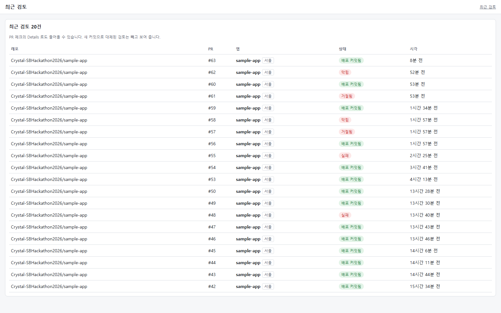
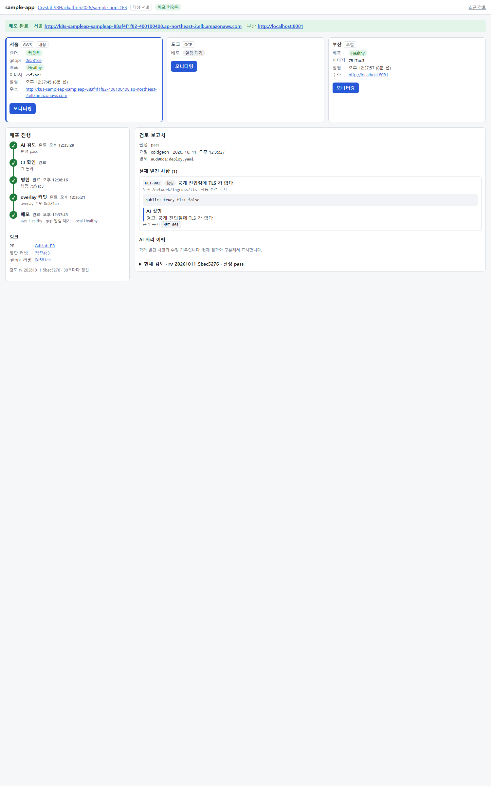
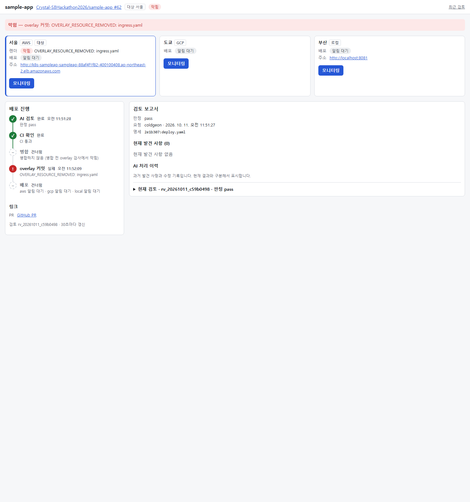
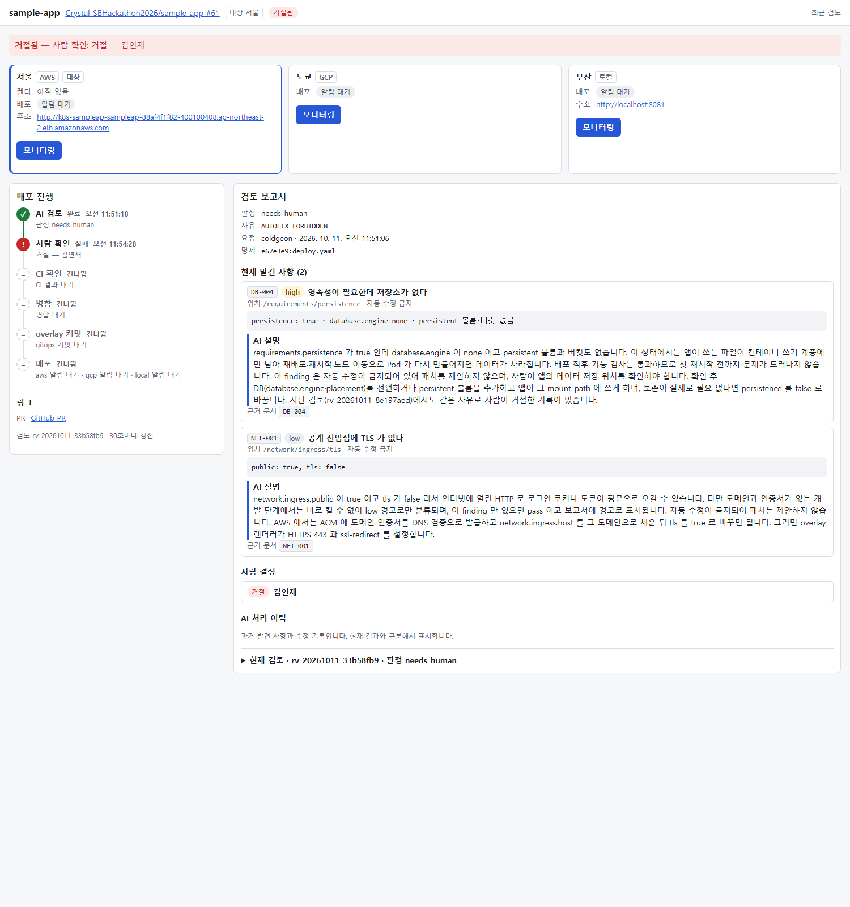
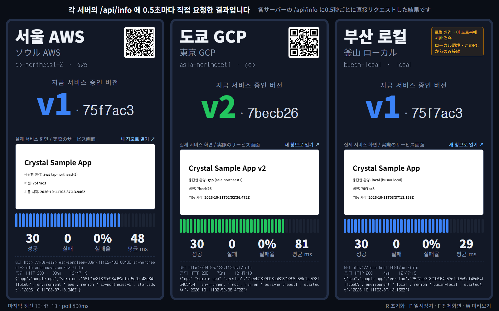

# 무엇을 시연할 수 있나

PR 하나를 올리면 AI가 검토하고, 통과한 것만 서울·도쿄·부산 세 환경에 각자 맞는 방식으로 배포됩니다.
**무엇을 넣으면 어떤 장면이 나오는지**를 실제 화면과 함께 정리했습니다.

아래 화면은 전부 **2026-10-11 리허설에서 실제로 찍은 것**입니다. 꾸민 그림이 아닙니다.

---

## 검토 결과는 네 갈래로 갈립니다



같은 앱에 올린 PR인데 결과가 다릅니다 — `배포 커밋됨` · `거절됨` · `막힘` · `실패`.
무엇을 넣었느냐에 따라 갈립니다.

| 넣는 것 | 규칙 | 나오는 것 | 걸린 시간 |
| --- | --- | --- | --- |
| 같은 이름을 `env` 와 `secrets` 양쪽에 | `SEC-004` | **AI가 직접 고쳐 커밋** → 재검토 통과 | 13초 |
| `requirements.persistence: true` | `DB-004` | **사람에게 넘김** → 승인 화면에서 결정 | 11초 |
| `network: {}` | `OVERLAY_RESOURCE_REMOVED` | AI는 통과시켰지만 **병합 직전 가드가 막음** | 32초 |
| 공개 진입점에 TLS 없음 | `NET-001` | **경고만** 하고 배포는 진행 | — |

---

## ① AI가 직접 고친다



같은 이름(`APP_NOTICE`)을 일반 환경변수와 비밀값 양쪽에 넣었습니다.
컨테이너에는 비밀값이 나중에 들어가 이기므로 **앞의 값은 쓰이지 않는데**, 명세와 git에는 남습니다.
예전 비밀이라면 평문으로 남는 셈입니다.

AI는 되돌릴 수 있는 문제라고 판단해 **`runtime.env` 쪽만 지우는 커밋**을 하고 다시 검토했습니다.

설명 끝에 이런 문장이 붙습니다.

> 지난 검토에서도 같은 방식으로 자동 수정되어 재검사를 통과했습니다.

**과거 사례를 근거로 인용합니다.** 배포 결과가 다음 검토의 근거가 되는 고리가 여기서 보입니다.

---

## ② AI가 통과시켜도 막힌다



**이 화면이 가장 중요합니다.**

```
판정        pass          ← AI 검토는 통과시켰다
병합        건너뜀         ← 병합하지 않음
overlay 커밋 실패          ← OVERLAY_RESOURCE_REMOVED: ingress.yaml
```

명세에서 외부 접속 설정을 통째로 지웠습니다. 문법은 멀쩡하고 규칙에도 안 걸립니다.
그런데 **병합 직전에 "실제로 만들어질 배포 결과"를 한 번 더 확인하는 가드**가, 지금 떠 있는 `ingress`가 사라지는 걸 보고 막았습니다.

이 규칙은 저희가 **개발 중에 실제로 겪은 장애**에서 나왔습니다.
2026-10-09, 명세가 없는 PR에서 자동 생성된 명세에 `ingress`가 빠졌고, 그대로 배포되어 로드밸런서까지 삭제됐습니다. 외부 접속이 10분간 끊겼습니다.

> AI를 믿되, 마지막은 코드가 봅니다.

---

## ③ AI가 사람에게 넘긴다



데이터를 저장하는 설정을 새로 켜는 변경입니다. 한 번 켜면 되돌리기 어렵습니다.
AI는 **자동으로 고치지 않고 이유만 설명한 뒤 결정을 사람에게 넘깁니다.**

승인 화면에서 사람이 승인하거나 거절합니다. 이 건은 거절했습니다.

> 판정은 코드가, 설명은 AI가, 결정은 사람이 합니다.

---

## 세 환경이 같은 커밋으로, 다른 방식으로



세 칸이 같은 저장소의 같은 커밋을 봅니다. 그런데 **배포 방식이 환경마다 다릅니다.**

| | 방식 | 무엇을 보고 판단하나 | 왜 |
| --- | --- | --- | --- |
| 서울 AWS | 카나리 | 앱 응답 **+ 에러율** | Prometheus가 있어 부분 실패까지 본다 |
| 부산 로컬 | 카나리 | 앱 응답 | 노트북 안 쿠버네티스 |
| 도쿄 GCP | **블루그린** | 사람이 승격 | DB가 걸려 있어 옛 버전과 섞이면 안 된다 |

위 화면은 **도쿄만 먼저 `v2`로 넘어간 순간**입니다. 사람이 승격을 누른 직후고, 서울·부산은 아직 `v1`입니다.

화면의 버전 문자열은 **이미지 태그 · 배포 설정 커밋 · 검토 기록의 키와 같은 값**입니다.
그래서 "지금 떠 있는 저것이 아까 그 PR이다"를 숫자 하나로 확인할 수 있습니다.

---

## 배포한 뒤에 드러나는 문제도 잡습니다

앱에 스위치를 두 개 두고 일부러 고장을 냅니다. **안전장치가 작동하는 걸 말이 아니라 실제로 보여주기 위해서입니다.**

### 일부 요청만 실패할 때 — 에러율이 잡는다

```
FAIL_RATE: "0.3"      요청의 30% 를 실패시킨다
```

앱은 응답하므로 **단순 헬스체크는 통과합니다.** 그런데 에러율이 기준 5%를 두 번 넘기자 배포가 스스로 멈추고 이전 버전으로 돌아갔습니다. 그동안 서비스는 끊기지 않았습니다.

```
RolloutAborted: Metric "error-rate" assessed Failed
                due to failed (2) > failureLimit (1)
```

> 🔴 **이건 트래픽이 있어야만 작동합니다.** 요청이 없으면 비율을 계산할 분모가 없어 그냥 통과합니다.
> 저희가 실제로 당했고(10/10), 그래서 분석이 도는 동안 요청을 계속 보내는 부하 장치를 따로 두었습니다.

### 아예 뜨지 못할 때 — 헬스체크가 잡는다

```
HEALTH_FAIL: "true"   /healthz 가 실패한다
```

60초 안에 준비되지 못하면 중단합니다. **에러율 분석과 별개로 도는 바깥쪽 안전장치**입니다.

---

## 구조 자체를 보여주는 것

PR을 올리지 않고도 화면으로 바로 확인할 수 있는 것들입니다.

| 질문 | 보여주는 법 |
| --- | --- |
| 검토 없이 병합하면? | PR Checks의 `review-service/verify`가 필수 체크라 **병합 버튼이 안 눌린다** |
| AI가 서버를 직접 만지나? | git에만 커밋한다. 클러스터를 손으로 고쳐도 **Argo CD가 git 상태로 되돌린다** |
| 사내망에 구멍을 뚫나? | 부산은 노트북 안의 Argo CD가 **밖으로 나가 가져온다.** 중앙 화면에 부산이 안 보이는 것이 증거 |
| 같은 커밋인 걸 어떻게 믿나? | 세 칸의 버전 문자열이 글자까지 같다 |

---

## 걸리는 시간

**PR을 올리고 세 환경에 배포될 때까지 1분 43초입니다.** (2026-10-11 실측, 사람이 승인하는 시간 제외)

```
10:46:27   PR 올림
10:46:40   AI 검토 완료 · 자동 수정 1회 포함        13초
10:47:20   자동 병합                              40초
10:47:24   배포 설정 커밋                           4초
10:48:10   세 환경 배포 완료                        46초
```

처음에는 6분 17초였습니다. 구간별로 재서 하나씩 줄였습니다.

| | | 무엇을 고쳤나 |
| --- | --- | --- |
| 처음 | 6분 17초 | |
| | 3분 57초 | 배포 도구가 새 커밋을 3분간 못 보던 캐시 |
| | 2분 31초 | 같은 빌드를 PR·main 두 번 하던 것, 한 줄 바꾸려 서버를 새로 띄우던 것 |
| | 2분 14초 | 카나리 분석 창 60초 → 30초 (지표 수집 주기도 같이) |
| 지금 | **1분 43초** | 세 환경 동시 |

---

## 아직 못 하는 것

정직하게 적습니다.

| | |
| --- | --- |
| DB 자동 생성 | 데이터베이스가 필요한 앱은 명세는 만들어지지만 실제 생성까지 못 간다 |
| 느린 장애 | 카나리는 30초만 본다. 메모리 누수처럼 천천히 나빠지는 건 못 잡는다 |
| 에러율 기준 5% | 실측 근거 없이 데모용으로 정한 값이다 |
| 부산 지표 | Prometheus가 서울에만 있어, 부산 그래프는 아직 비어 있다 |
